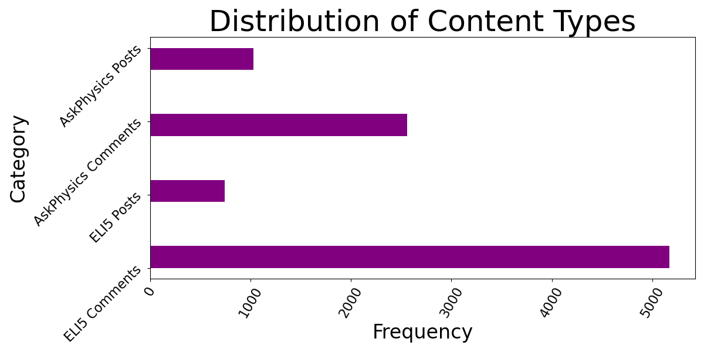

# **Explain Like I'm Not a Scientist**
### *An exploration of (not so) scientific communication*
###### Emily K. Sanders, DSB-318, May 3, 2024
---

## Summary
An investigation of scientific communication using classification algorithms and data scraped from [r/ExplainLikeImFive](https://www.reddit.com/r/explainlikeimfive/new/) and [r/AskPhysics](https://www.reddit.com/r/AskPhysics/new/).

## Problem Statement
Scientific communication - the relaying of complex scientific information from experts to laypeople - is hugely important for an educated populace, but infamously difficult to do well.  Any insight into how it works and how to do it well could yield exponential benefits in reduced future misinformation.  In this report is to establish the utility of analyzing submissions from r/explainlikeimfive and r/AskPhysics as exemplars of scientific communication, with r/explainlikeimfive modeling successful strategies for communicating with laypeople, and AskPhysics serving as a control, where members are expected to have a greater level of baseline knowledge.  I will do this by building a model to differentiate between documents from each subreddit, thus providing strong support for the notion that they are meaningfully different in nature, and that their points of divergence can offer useful insights.  Based on the results of this attempt, I will recommend future work to learn more about the do's and don't's of successful communication.

## Metric of Success
Because neither of these categories is meaningfully positive or negative (compared, for instance, to classifying disease or fraud), I will use overall accuracy score to gage success rather than specializing in reducing false positives or negatives.  However, because the greater goal of this work is to establish these two subreddits as useful models of scientific communication for future work to further examine, my most important metric for success is a model with minimal variance.  I want to build a model that is genuinely picking up on something happening in the text, not just "memorizing the answers" to the training data.  Therefore, as long as the model is correctly classifying 80% or more of the documents, I will prioritize reducing variance over increasing accuracy.

## Deliverables
- A written report of my procedure, findings, and recommendations for future work.
- Slides from the presentation of this report to the *2024 Greater Lafayette Association for Data Science Conference on Activism for a Thriving Society*.

## Repository Structure
This repository contains two loose files (this readme, plus the PDF of the presentation), and four folders.  The `data` and `images` folder contain material that is linked to and embedded (or generated) throughout the notebooks.  The `data` folder also contains, in the `input` subfolder, a zip file called `single-scrapes.zip`.  This folder contains all CSVs of all interations of scraping, made available for anyone who wishes to use or peruse them.  (Be warned, there are a lot of them!)  The `supplementary-materials` folder contains the articles I linked to on my slides.

Most importantly, the `notebooks` folder contains 5 Jupyter notebooks, in which the body of my report can be found.  These notebooks are named with numbers so that they will appear in the correct order.

## Method and EDA
Using `python`, I scraped posts and comments from r/AskPhysics and r/explainlikeimfive.  Although I aimed for balanced classes, the addition of comments shifted the proportions.

#### Counts by Category

|        |ELI5|AskPhysics|Total|
|--------|----|----------|-----|
|Posts   | 740 (7.8%) | 1028 (10.8%) | 1768 (18.6%) |
|Comments| 5170 (54.4%) | 2557 (26.9%) | 7727 (81.4%) |
|Total   | 5910 (62.2%) | 3585 (37.8%) | 9495 (100%) |
---

## Modeling

I tested two model pipelines: a logistic regression versus a multinomial naive Bayes, both using `sklearn`'s `CountVectorizer()` to tokenize and count the words per post.  My initial gridsearches over these models produced accuracy scores in the mid-80s, satisfying my metric for accuracy.  When I attempted to fine tune the hyperparameters with additional gridsearches over approximately 1500 combinations per model, the accuracy improved to about 87% in the testing data, but variance also increased.  Therefore, I adopted the following model:

|Parameter|Value|
|-|-|
|Estimator|Multinomial Naive Bayes|
|Maximum features|1000|
|Maximum document frequency| 75%|
|Minimum document frequency| n=2|
|Ngram range| (1, 1) |
|Stop words| None|
|Smoothing alpha|0.9|
|Training Accuracy|84.42%|
|Testing Accuracy|84.37%|
|Variance|<0.0006|
---

Based on these values, the baseline score to beat is 62.2%.  If the model classifid all observations as belonging to eli5, this is how often it would be correct.

## Conclusions and Recommendations
Based on several iterations of gridsearching, I adopted a model that can differentiate between documents from the two subreddits up to my criteria for success: an accuracy score of >80% on the testing set (84.37%), and minimal variance (<0.0006).  Although other hyperparameter combinations offered modest increases to accuracy, I chose to minimize variance in order to maximize generalizability to the subreddits as a whole.  

By showing that this can be done, I have provided support for my proposition that these two subreddits could serve as useful model representations of scientific communication. Therefore, I recommend further research on the communication norms of these two subreddits, as a promising source of insight on how to improve scientific communication.  

